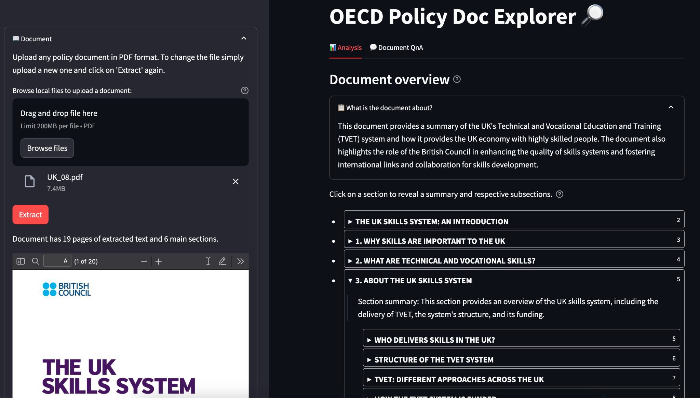

# Hack4Good - NLP for policy trend analysis (OECD)

[](https://github.com/dvdblk/hack4good-oecd/releases)
[](.pre-commit-config.yaml)
[](pyproject.toml)

This project was created for the [Hack4Good 2023](https://www.analytics-club.org/hack4good) hackathon in collaboration with [OECD](https://www.oecd.org/switzerland/).

<p align="center" width="100%">

</p>


* GUI via Streamlit
* Extracts semi-structured PDF into structured text using [Adobe PDF Extract API](https://developer.adobe.com/document-services/docs/overview/pdf-extract-api/)
* Uses PDFTriage[^1] style prompting (similar to ReAct) to answer questions about the documents.
* Answers to questions provide the section where they were found in the document.


[^1]: Saad-Falcon, J., Barrow, J., Siu, A., Nenkova, A., Yoon, D. S., Rossi, R. A., & Dernoncourt, F. (2023). [*PDFTriage: Question Answering over Long, Structured Documents*](https://arxiv.org/abs/2309.08872). arXiv preprint arXiv:2309.08872

## GUI Quickstart

Environment variables need to be set in order to run the interactive GUI.
Create an `.env` file in the root of the repo (you can use `cp .env.default .env`) with the following variables:

| Environment Variable | Description |
| --- | --- |
| `ADOBE_CLIENT_ID` | Create Adobe Developer account and select "Get credentials" [here](https://developer.adobe.com/document-services/docs/overview/pdf-extract-api/) |
| `ADOBE_CLIENT_SECRET` | Copy from "Get credentials" [here](https://developer.adobe.com/document-services/docs/overview/pdf-extract-api/) as with `ADOBE_CLIENT_ID` |
| `OPENAI_API_KEY` | Get the [OpenAI API key](https://help.openai.com/en/articles/4936850-where-do-i-find-my-api-key) |

After setting the environment variables (make sure to to **not** enclose the env variables in quotes), you can run the code in one of two ways:

<details>
<summary><b><font size="+1">Conda Environment</font></b></summary>

1. Create a [conda](https://conda.io/projects/conda/en/latest/user-guide/install/index.html) environment with the required dependencies:

To **create** a conda environment after cloning the repo:
```
# from the root of the repo
conda env create -f environment.yml
# to activate the environment
conda activate hack4good
# to deactivate the environment (when you're done)
conda deactivate
```

(Optional) To **update** the conda environment after pulling latest changes:
```
conda activate hack4good
conda env update -f environment.yml --prune
```

(Optional) To **remove** the conda environment:
```
conda deactivate
conda env remove -n hack4good
```

2. Run the streamlit app
```
python -m streamlit run app/main.py
```

3. Access the streamlit app at [http://localhost:8501](http://localhost:8501)
</details>

<details>
<summary><b><font size="+1">Docker</font></b></summary>

1. Run (or build) the [Docker](https://docs.docker.com/get-docker/) image

To **run** the latest docker image:
```
docker run -p 8501:8501 --env-file .env --volume $PWD/data:/app/app/data ghcr.io/dvdblk/hack4good-oecd/app:latest
```

(Optional) To **build** the docker image locally (after cloning the repo) and run it:
```
docker build -t hack4good .
docker run -p 8501:8501 --env-file .env --volume $PWD/data:/app/app/data hack4good
```

2. Access the streamlit app at [http://localhost:8501](http://localhost:8501)

</details>

## Contributing
1. Install [pre-commit](https://pre-commit.com/#installation).
2. Run `pre-commit install` to apply the repo's pre-commit hooks to your local git repo.
3. Add your changes, commit and create a pull request with `main` branch as the target.
